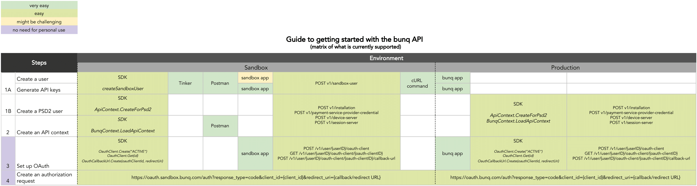

# Introduction

## Welcome to bunq!

The bunq API is based on the RESTful principles. It returns responses in the JSON format. The only exclusion is binary \(image\) files.

## Getting Started

1. **Create a user account with your phone.** Afterwards, you can use this account to create an API key from which you can make API calls. You can create an API key either in our [developer portal ](https://developer.bunq.com)or in the bunq app \(_Profile → Security & Settings → Developers → API keys\)_.
2. **Register a device.** A device can be a phone \(private\), computer or a server \(public\). You can register a new device by using the _installation_ and _device-server_ calls.
3. **Open a session.** Sessions are temporary and expire in the same amount of time you have set for auto logout in your user account.
4. **Make your first call!**

Here is an overview of what you can use to get started with the bunq API: 


Looking to start with the sandbox environment first? Jump to the [Sandbox page](https://beta.doc.bunq.com/basics/sandbox).




## Versioning

Developments in the financial sector, changing regulatory regimes and new feature requests require us to be flexible. This means we can iterate quickly to improve the API and related tooling. This also allows us to quickly process your feedback \(which we are happy to receive!\). Therefore, we have chosen not to attach any version numbers to the changes just yet. We will inform you in a timely manner of any important changes we make before they are deployed on together.bunq.com.

Once the speed of iteration slows down and more developers start using the API and its sandbox we will start versioning the API using the version number in the HTTP URLs \(i.e. the `v1/` part of the path\). We will inform you when this happens.

