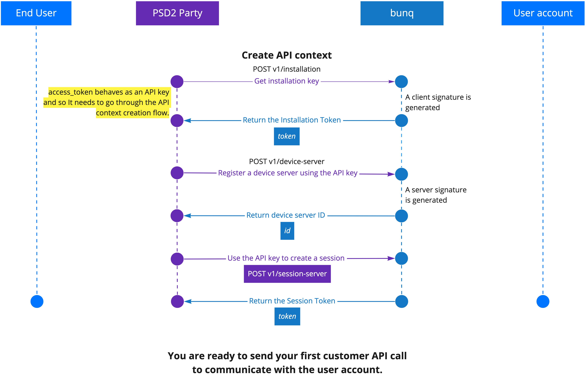

# Introduction

## Welcome to bunq!

The bunq API is based on the RESTful principles. It returns responses in the JSON format. The only exclusion is binary \(image\) files.

## Getting Started

Before you start sending API requests, you need to get an API key and activate it. API activation happens when you install it and link your IP address and device to it \(create an API context\). The steps below will guide you through what you need to do to start sending custom API requests.

1. **Create an API key.** You can do it either in our [developer portal ](https://developer.bunq.com)or in the bunq app \(_Profile → Security & Settings → Developers → API keys\)_. If you want to test our sandbox first, our [bunq Developer ](https://developer.bunq.com)is the best place to start.
2. **Register a device.** A device can be a phone \(private\), a computer, or a server \(public\). You can register a new device by using the `POST /installation` and `POST /device-server` calls. This will activate your API key. You only need to do this once.
3. **Open a session.** Sessions are temporary and expire after the auto-logout time set for the user account. It can be changed in the bunq app.
4. **Make your first call!**


Looking to start with the sandbox environment first? Jump to the [Sandbox page](https://beta.doc.bunq.com/basics/sandbox).




## Versioning

Developments in the financial sector, changing regulatory regimes and new feature requests require us to be flexible. This means we can iterate quickly to improve the API and related tooling. Therefore, we have chosen not to attach any version numbers to the changes just yet. 

We will inform you in a timely manner of any important changes we make before they are deployed on together.bunq.com. You can also [subscribe to our API newsletter](https://bunq.us8.list-manage.com/subscribe?u=c00d0d6daea4e1cf7c863d52e&id=b08680cdc7) to make sure you don't miss any important updates. 

