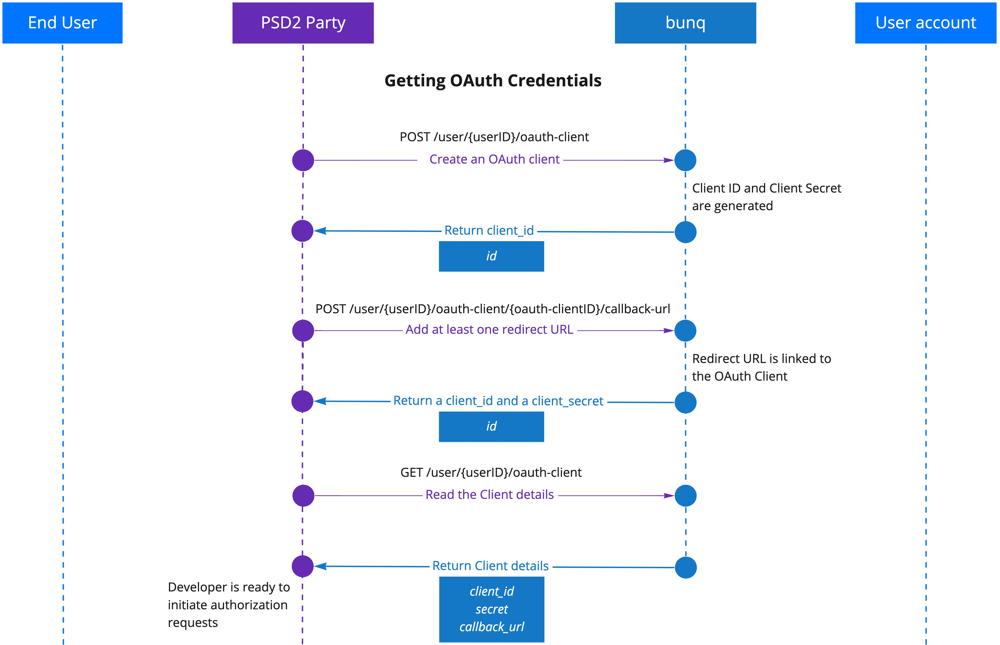
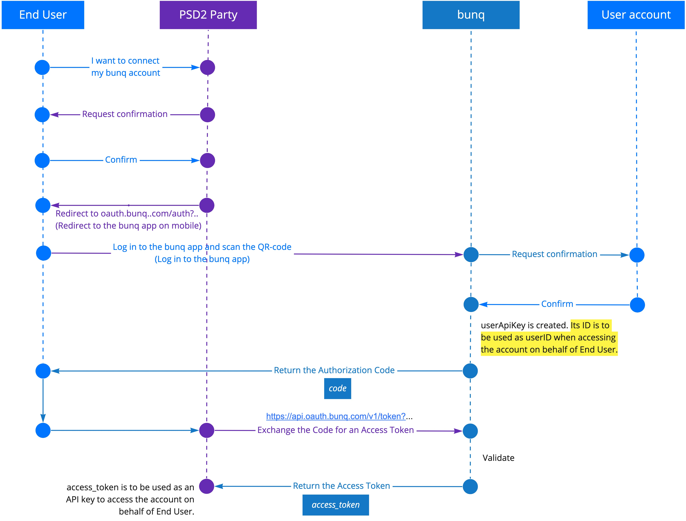
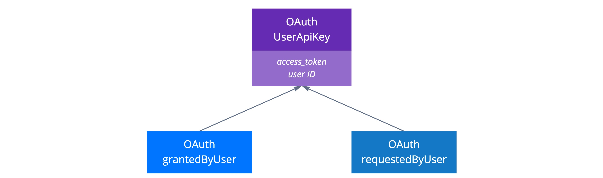

# OAuth


[OAuth 2.0](https://www.oauth.com/oauth2-servers/getting-ready/) is a protocol that will let your app connect to bunq users in a safe and easy way. Please be aware that if you will gain access to the account information of other bunq users or initiate a payment for them, [you may require a PSD2 permit](https://beta.doc.bunq.com/other/faq#can-we-use-the-bunq-api-to-offer-services-to-third-parties).


## What can my apps do with OAuth?

The permissions OAuth allows are the following:

* read and create _Monetary Accounts;_
* read _Payments_ & _Transactions;_
* create _Payments_ between _Monetary Accounts_ of the same user;
* create _Draft-Payments_ \(the user will need to approve the payment using the bunq app\)_;_
* assign a Monetary account to a _Card;_
* read, create and manage _Cards_;
* read and create _Request-Inquiries_
* read _Request-Responses_.


As a PSD2-licensed developer, you are limited to the permission scopes of your role.


## Get started with OAuth

To initiate authorization into the bunq user accounts, you need to create an OAuth Client and register at least 1 redirect URL for it. 


You can have 1 OAuth Client at a time. Reuse your OAuth credentials for every authorization request. 


The list of steps below will help you to get started:

1. Register an OAuth Client by creating an app in [bunq Developer](https://developer.bunq.com/portal)_._
2. Add one or more redirect URLs.
3. Get your `client_id` and `secret` from your app information tab in [bunq Developer](https://developer.bunq.com/portal).
4. Redirect your users to the [OAuth authorization request URL](https://beta.doc.bunq.com/basics/oauth#authorization-request).
5. If the user accepts the authorization request, they will be redirected to the previously specified `redirect_uri` with an authorization `code` parameter.
6. Use the [token endpoint](https://beta.doc.bunq.com/basics/oauth#token-exchange) to exchange the authorization `code` for an `access_token`.
7. Use the `access_token` as a normal API Key. Open a session or use [our SDKs](https://github.com/bunq) to get started.


You can set up an OAuth Client and add redirect URLs to it using the dedicated endpoints too. Follow the flow below to do it programmatically.



As a PSD2 user, you cannot log in to the bunq app. You need to follow the flow below to register an OAuth Client for your application.




## Authorization Request

Your web or mobile app must redirect users `https://oauth.bunq.com/auth` using the following parameters:

* `response_type` - bunq supports the authorization code grant. Provide `code` as a parameter **\(required\)**;
* `client_id` - your _Client ID_ that you can get from the bunq app **\(required\)**;
* `redirect_uri` - the URL you wish the user to be redirected to after the authorization is complete **\(required\)**;
* `state` - a unique string to be passed back upon completion **\(optional\).**


Use`https://oauth.sandbox.bunq.com/auth`in the sandbox environment.


#### **Authorization request example:**

```text
https://oauth.bunq.com/auth?response_type=code
&client_id=1cc540b6e7a4fa3a862620d0751771500ed453b0bef89cd60e36b7db6260f813
&redirect_uri=https://www.bunq.com
&state=594f5548-6dfb-4b02-8620-08e03a9469e6
```

#### **Authorization request response example:**

```text
https://www.bunq.com/?code=7d272be434a75933f40c13d56aef6c31496005b653074f7d6ac57029d9995d30
&state=594f5548-6dfb-4b02-8620-08e03a9469e6
```



## Token Exchange

If the authorization request is accepted by the user, you get the authorization `code`_._ Exchange it for an `access_token`.

Make a `POST` call to `https://api.oauth.bunq.com/v1/token` . Pass the following parameters as `GET` variables:

* `grant_type` - the grant type used, use `authorization_code` for now **\(required\)**
* `code` - the authorization _Code_ you received after the authorization request was accepted **\(required\)**
* `redirect_uri` - the same redirect URL you used with the authorization request **\(required\)**
* `client_id` - your _Client ID_ **\(required\)**
* `client_secret` - your _Client Secret_ **\(required\)**


Use`https://api-oauth.sandbox.bunq.com/v1/token`in the sandbox environment.


**Token request example:**

```text
https://api.oauth.bunq.com/v1/token?grant_type=authorization_code
&code=7d272be434a75933f40c13d56aef6c31496005b653074f7d6ac57029d9995d30
&redirect_uri=https://www.bunq.com/
&client_id=1cc540b6e7a4fa3a862620d0751771500ed453b0bef89cd60e36b7db6260f813
&client_secret=184f969765f6f74f53bf563ae3e9f891aec9179157601d25221d57f2f1151fd5
```


The request should only contain URL parameters. No body is expected.


**Example of a successful response:**

```text
{
    "access_token": "8baec0ac1aafca3345d5b811042feecfe0272514c5d09a69b5fbc84cb1c06029",
    "token_type": "bearer",
    "state": "594f5548-6dfb-4b02-8620-08e03a9469e6"
}
```

**Example of an error response:**

```text
{
    "error": "invalid_grant",
    "error_description": "The authorization code is invalid or expired."
}
```


#### What's next?

The `access_token` you've received can be used as a normal API key. Use it to [create an authorized session](https://lexy.gitbook.io/bunq/basics/authentication) with the user account. 


## User ID vs item IDs

When connecting to a bunq user's account using OAuth, you create a new user \(`userApiKey`\) that has its own `id` and `access_token` . When sending a request on behalf of a user connected to your app via OAuth,  use the `id` of `userApiKey`  as `userId` and the item `id`s of the bunq user \(`grantedByUser`\).

**Example of a successful request URL:**

```text
https://api.bunq.com/user/{userApiKey's userId}/monetary-account/{grantedByUser's monetary-accountId}/payment
```


When calling `GET /user/{userID},`you will expect to get `UserPerson` or `UserCompany`. Instead,  you will get the `UserApiKey` object, which contains references to both the user that requested access _\(you\)_ and the user that granted access _\(the bunq user account that your app is connected to\)_. 




## Using the Connect button

Ready to connect to bunq users to your application? Do it with a **Connect to bunq** button. Feel free to use our style guide and prebuilt design assets.

* [Style guide](https://bunq.com/info/oauth-styleguide)
* [Connect button assets](https://bunq.com/info/oauth-connect-buttons)

