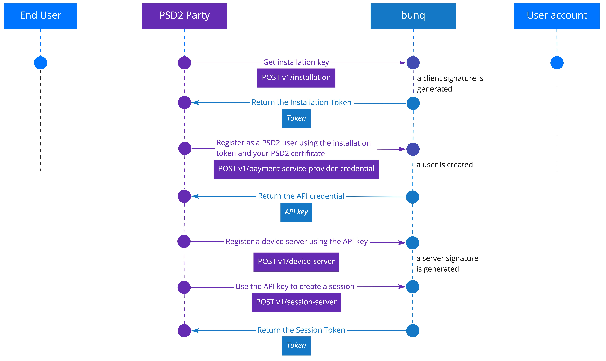
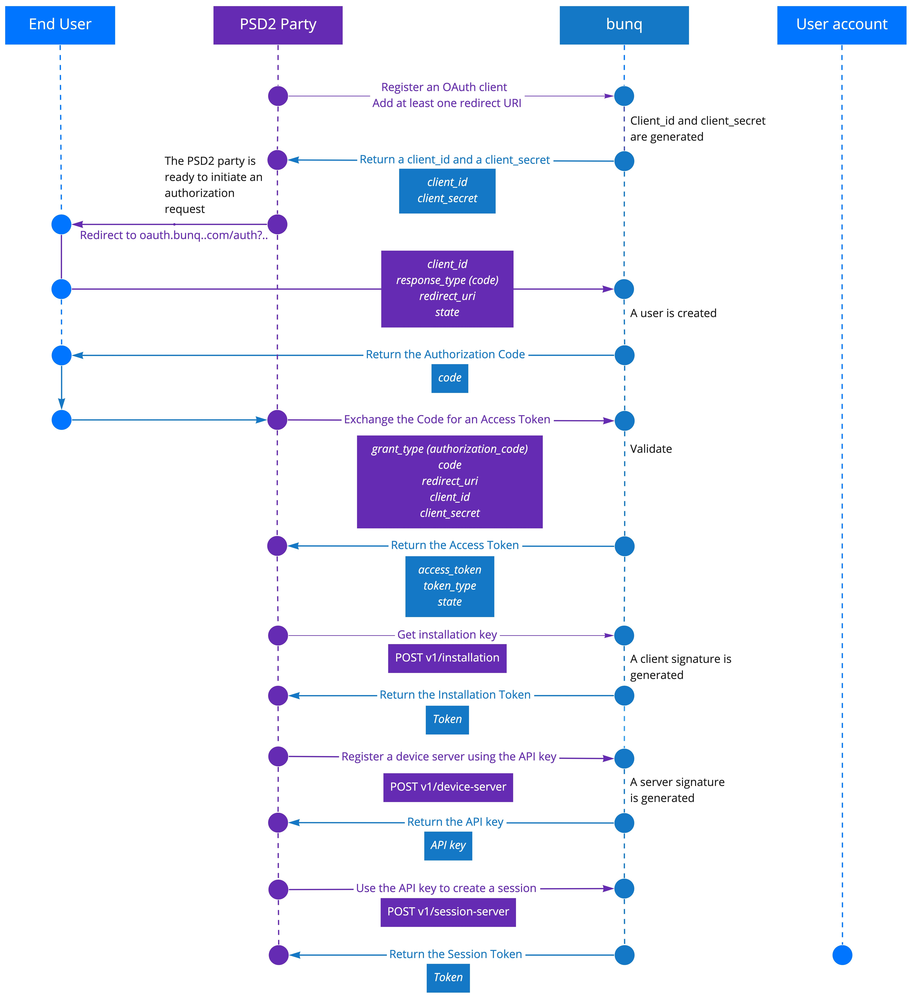

# Connect as a PSD2 service provider

As a service provider, either an Account Information Service Provider \(AISP\) or Payment Initiation Service Provider \(PISP\), you have obtained or are planning to obtain a licence from your local supervisor. You will need your unique eIDAS certificate number to start using the PSD2-compliant bunq API on production.


You can test how it works in our sandbox. It is currently not available on production.


We currently accept pseudo certificates so you could test the flow. You are free to create the certificate yourself but make sure to follow these criteria:

* Up to 64 characters
* PISP and/or AISP used in the end

## Register as a service provider

Before you can read information on bunq users or initiate payments, you need to register a PSD2 account and receive credentials that will enable you to access the bunq user accounts.

1. Execute `POST v1/installation` and get your installation _Token_ with a unique random key pair.
2. Use the installation _Token_ and your unique PSD2 certificate to call `POST v1/payment-service-provider-credential`. This will register your software.
3. Receive your API key in return. It will identify you as a PSD2 bunq API user. You will use it to start an OAuth flow. The session will last 90 days. After it closes, start a new session using the same API key.
4. Register a device by using `POST v1/device-server` using the API key for the secret and passing the installation _Token_ in the `X-Bunq-Client-Authentication` header.
5. Create your first session by executing `POST v1/session-server`. Provide the installation _Token_ in the `X-Bunq-Client-Authentication` header. You will receive a session _Token_. Use it in any following request in the `X-Bunq-Client-Authentication` header.


The first session will last 1 hour. Start a new session within 60 minutes.


## Register your application

Before you can start authenticating on behalf of a bunq user, you need to get _Client ID_ and _Client Secret_, which will identify you in requests to the user accounts.

1. Call `POST /v1/user/{userID}/oauth-client`
2. Call `GET /v1/user/{userID}/oauth-client/{oauth-clientID}`. We will return your _Client ID_ and _Client Secret_.
3. Call `POST /v1/user/{userID}/oauth-client/{oauth-clientID}/callback-url`. Include the OAuth callback URL of your application.
4. You are ready to initiate authorization requests.

