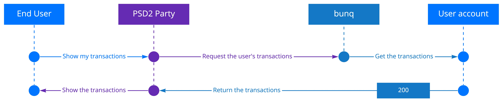

# AISP

As an AISP, you are allowed to authenticate in a user’s account with the following permissions:

* access account information \(read\):
  1. legal name
  2. IBAN
  3. nationality
  4. card validity data
  5. transaction history
  6. account balance

Once a bunq user has confirmed they want to connect their account via your application, you can initiate the authorization flow.

1. Open a session on the bunq server.
2. Initiate an authorization request. If your identity is validated, we will send you a confirmation upon its creation. Pass the following parameters with the request:
   * _response\_type_
   * _client\_id_ \(here _response\_type=code&client\_id_\)
   * \*redirect\_uri
   * \*state
3. If the bunq user confirms their will to let your application connect to their account, we will return you a Code.
4. Exchange the _Code_ for an _Access Token_. Make a `POST` call to `https://api.oauth.bunq.com/v1/token` passing the following parameters:
   * _code \(at this stage, grant\_type=authorization\_code&code\)_
   * _redirect\_uri_
   * _client\_id_
   * _client\_secret_
5. We return the _Access Token_. Use it every time you interact with the bunq user’s account.

