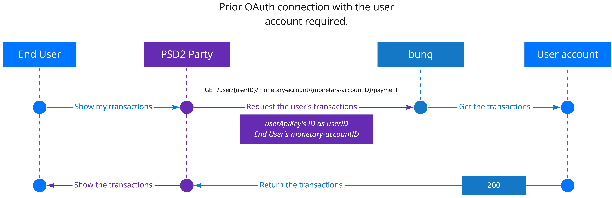

# AISP

As an AISP, you are allowed to authenticate in a user’s account and access \(read\) the following account information:

1. legal name
2. IBAN
3. nationality
4. card validity data
5. transaction history
6. account balance

To read the user's information, you need to establish a connection with their bunq account. You can do it using an [authorization request](https://beta.doc.bunq.com/basics/oauth#authorization-request). Once a bunq user has confirmed the authorization request and you have done the [token exchange](https://beta.doc.bunq.com/basics/oauth#token-exchange), you can activate the Access Token \(use it as an API key\).


Token activation happens when you create an API context \(install it and link your IP adrress and device to it\). See the [OAuth](https://beta.doc.bunq.com/basics/oauth) page for the full flow illustration.




An active Access Token allows you to communicate with the bunq user’s account. You can use it to start a session to interact with the monetary accounts the user allows you to access.

