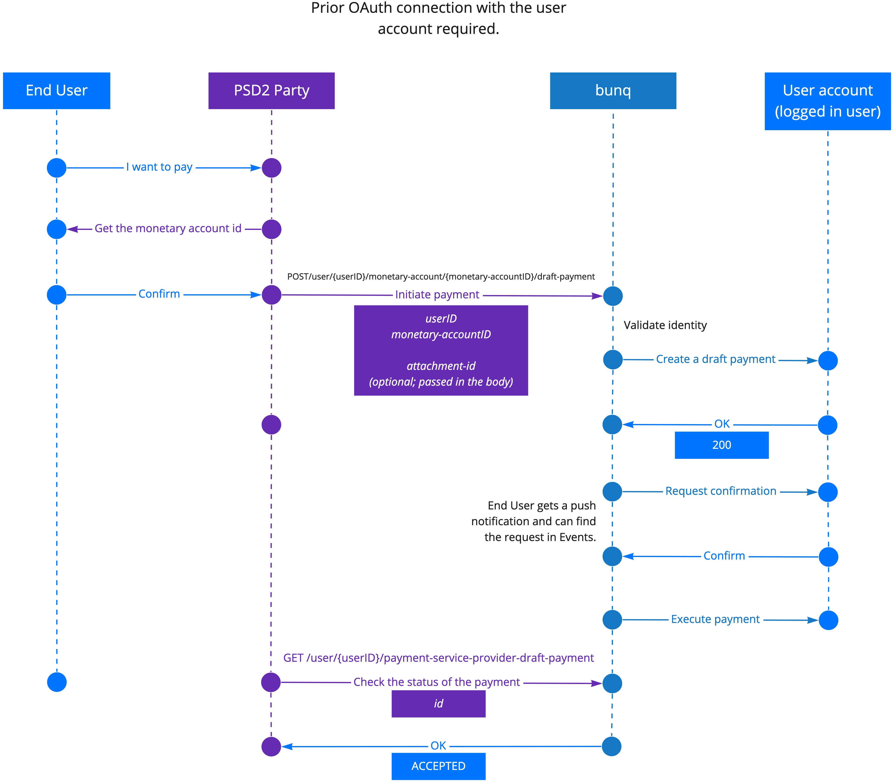

# PISP

As a PISP, you are allowed to authenticate in a user’s account with the following permissions:

1. read account information \(via`GET /user`\):
   * legal name;
   * IBAN;
2. initiate payments \(create draft payments via either  `POST /user/{userID}/monetary-account/{monetary-accountID}/draft-payment` or `POST /user/{userID}/payment-service-provider-draft-payment`\) and read their statuses;
3. confirm that the account balance is sufficient for covering the payment \(via`POST /user/{userID}/confirmation-of-funds`\).

The bunq API provides endpoints for different scenarios of the implementation of the payment initiation functionality. In particular, as a PISP user, you can build applications that initiate and authorize one-off or multiple incoming payments. Depending on the use case you are intending to deploy, you might need to initiate the OAuth authorization either before or after the payment initiation.  

## Authorization of multiple \(scheduled\) payments

It is possible to initiate payments from a bunq user's account having previously established an OAuth connection between your application and the bunq user's account. The bunq user will receive push notifications for each initiated payment.

Once a bunq user has [confirmed they want to make payments via your application](https://beta.doc.bunq.com/psd2/connect-as-a-psd2-service-provider#register-your-application), you can initiate the payment confirmation flow.

1. Create a draft payment via `POST /user/{userID}/monetary-account/{monetary-accountID}/draft-payment`

    passing the following parameters:

   1. `monetary-accountId and userId` \(`userApiKey`'s `id`; see [OAuth](https://beta.doc.bunq.com/basics/oauth#user-id-vs-item-ids) for more information\) in the endpoint URL;
   2. the customer’s email address, phone number, or IBAN in the `counterparty_alias` field of the request body.

2. If the user confirms their intent to make the payment, bunq carries out the transaction.
3. Check the status of the payment via `GET /user/{userID}/monetary-account/{monetary-accountID}/draft-payment`

    using the draft payment `id` parameter returned in the previous step. 

## Single payment authorization

It is possible to initiate payments having only the IBAN of the payer using `POST /user/{userID}/payment-service-provider-draft-payment`.  In this case, the bunq user will accept the payment along with the authorization request. No additional push notifications are sent to the user. 

1. Collect the bunq user's IBAN \(and name\) in the UI of your application.
2. Create a draft payment via `POST /user/{userID}/payment-service-provider-draft-payment`. 
3. Initiate an [authorization request.](https://beta.doc.bunq.com/basics/oauth#authorization-request) Upon the QR-code scan, the bunq user will see and be able to either accept or reject the payment authorization request.
4. Check the status of the payment.

